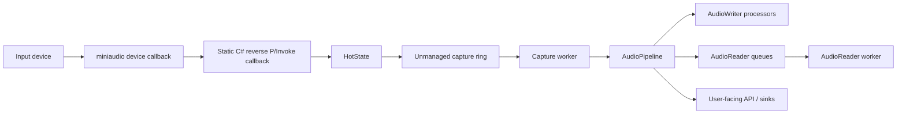
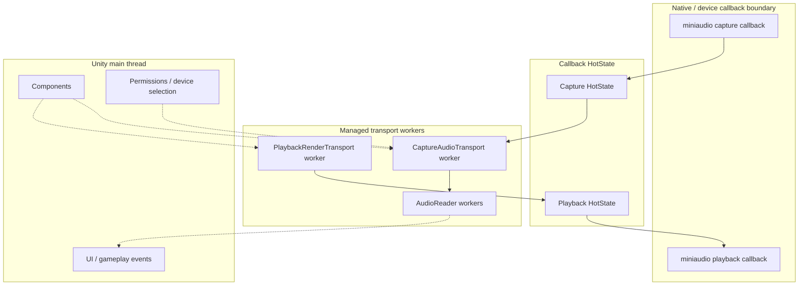

# Architecture

EasyMic uses miniaudio for native device access and managed C# for Unity-facing orchestration. The current architecture keeps native callbacks thin and moves processing to transport workers.

## Practical Data Flow

Capture:



```text
miniaudio device callback
  -> static C# reverse P/Invoke callback
  -> callback HotState
  -> unmanaged capture ring
  -> capture worker
  -> AudioPipeline
  -> AudioReader / AudioWriter / user-facing API
```

Playback:

```mermaid
flowchart LR
    Producer["Unity/API source or producer"] --> Session["PlaybackAudioSession / PlaybackAudioSource"]
    Session --> RenderWorker["Playback render worker"]
    RenderWorker --> Mixer["AudioMixer"]
    Mixer --> SourceProcessors["Source / mixer processors"]
    SourceProcessors --> PlaybackRing["Unmanaged playback ring"]
    PlaybackRing --> StaticCb["Static C# reverse P/Invoke callback"]
    StaticCb --> NativeCb["miniaudio output callback"]
    NativeCb --> Output["Output device"]
```



```text
Unity playback source / producer
  -> PlaybackAudioSession / PlaybackAudioSource
  -> playback render worker
  -> AudioMixer / transport-safe processors
  -> unmanaged playback ring
  -> static C# reverse P/Invoke callback
  -> miniaudio output
```

EasyMic keeps the miniaudio callback path intentionally small. The callback moves audio data through preallocated transport buffers and records counters; higher-level processing runs on worker threads or the Unity main thread.

## Thread Boundaries



## Main Runtime Pieces

| Piece | Responsibility |
|---|---|
| `EasyMicAPI` | Public recording facade for device refresh, recording lifecycle, processor management, and recording diagnostics. |
| `MicSystem` | Owns the miniaudio capture context, device cache, hot-plug watcher, and active recording sessions. |
| `RecordingSession` | Owns one capture device, its callback `HotState`, capture transport, processor blueprint map, and diagnostics. |
| `CaptureAudioTransport` | Bounded unmanaged SPSC ring plus worker thread for capture frames. |
| `AudioPipeline` | Ordered immutable processor snapshot executed by transport workers. |
| `AudioSystem` | Singleton miniaudio playback device, master mixer, playback callback, and playback telemetry. |
| `PlaybackRenderTransport` | Playback render worker that pre-renders mixer blocks into an unmanaged playback ring. |
| `PlaybackAudioSession` | Pure C# clip/stream playback controller. |
| `PlaybackAudioSourceBehaviour` | Unity component wrapper for clip and stream playback. |

## HotState and ColdState

`HotState` is the small state object reachable from the native callback. It contains only callback-safe references and flags: transport pointer, telemetry, channel count, stopping/disposed flags, and active callback counters.

Cold state is the rest of the session or system: device objects, worker maps, processor lists, Unity component state, managed events, and lifecycle code. Cold state is not traversed from the callback.

This split lets stop/dispose mark hot state as stopping, wait briefly for active callbacks to drain, detach the transport, and then release native resources.

## Callback Model

EasyMic still enters managed C# from miniaudio through static reverse P/Invoke callbacks. IL2CPP builds use `MonoPInvokeCallback` attributes where required.

The callback path:

- does not run user processors;
- does not call Unity APIs;
- does not allocate intentionally in steady state;
- copies capture input into a transport ring or reads playback output from a transport ring;
- records atomic telemetry counters;
- zero-fills playback output when data is unavailable.

This is suitable for low-latency managed Unity audio, but it is not strict hard realtime native middleware.

## Where Processors Run

| Location | Runs |
|---|---|
| miniaudio callback | Internal transport copy/read and telemetry only. |
| capture worker | Capture `AudioPipeline` processors. |
| playback render worker | Mixer/source processors and render work. |
| `AudioReader` worker | Reader-specific async work after a processor enqueues frames. |
| Unity main thread | Components, UI, gameplay, device selection, permission flow, and main-thread dispatch. |

`AudioPipeline` uses immutable snapshots so processors can be added or removed without locking the worker's hot loop. Removed workers are retired safely after active passes complete.

## Unity API Rules

Unity APIs are main-thread APIs unless Unity documents otherwise. Do not call Unity APIs from:

- miniaudio callbacks;
- capture transport workers;
- playback render workers;
- `AudioReader` worker threads.

Use Unity components, queued events, or a main-thread dispatcher for UI/gameplay integration.

## Lifecycle Notes

- `EasyMicAPI.Cleanup()` disposes the microphone system and clears cached initialization failure state.
- Runtime subsystem registration resets static capture and playback state on domain/runtime reload.
- `AudioSystem.Stop()` stops the native device, waits for active callbacks, disposes playback transport, clears events, and releases miniaudio handles.
- `StopRecording(handle)` removes and disposes the recording session. Retrieve processor state before stopping if you need it.

## Notes for Previous EasyMic Users

The current architecture uses a hardened callback path. User processors no longer run in the miniaudio callback. Transport-sensitive work runs on capture/playback workers, and Unity-facing events are dispatched outside the callback.
