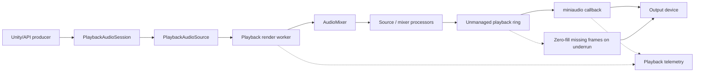

# Playback

EasyMic playback uses a miniaudio output device, a managed mixer, and a playback render worker. The output callback consumes pre-rendered samples from an unmanaged ring.

## Playback Flow



```text
Unity/API source
  -> PlaybackAudioSession / PlaybackAudioSource
  -> playback render worker
  -> AudioMixer / source processors
  -> unmanaged playback ring
  -> miniaudio callback
  -> output device
```

The miniaudio callback does not mix sources or run processors. It reads from the playback ring and zero-fills missing frames.

## Play an AudioClip

```csharp
PlaybackHandle handle = AudioPlayback.PlayClip(
    clip,
    loop: false,
    volume: 1f,
    autoDisposeOnComplete: true,
    latencyProfile: EasyMicLatencyProfile.LowLatency);
```

Use `PlaybackHandle` to pause, resume, stop, change volume, or dispose.

## Stream Interleaved PCM

```csharp
PlaybackHandle stream = AudioPlayback.CreateStream(1f, EasyMicLatencyProfile.Balanced);

EasyMicEnqueueResult result = stream.TryEnqueue(
    samples,
    count: samples.Length,
    channels: 1,
    sampleRate: 24000);

if (!result.Success)
{
    Debug.LogWarning($"Could not enqueue all samples: {result.Status}");
}

stream.CompleteStream();
```

`TryEnqueue` reports partial writes, full queues, disposed handles, and invalid formats. Streaming producers should watch `BufferedSeconds` and avoid pushing unbounded audio.

## Component Playback

`PlaybackAudioSourceBehaviour` wraps `PlaybackAudioSession` for scene use.

Useful members:

- `PlayClip(AudioClip clip, bool loop = true)`;
- `Play()`, `Resume()`, `Pause()`, `Stop()`;
- `TryEnqueue(...)`;
- `CompleteStream()`;
- `BufferedSeconds`;
- `ProgressNormalized`;
- `OnPlaybackCompleted`;
- `OnAudioPlaybackRead`.

`OnAudioPlaybackRead` is not a Unity main-thread event. Treat it as audio-thread/transport-sensitive data and keep handlers small.

## Watermark Scheduling

`PlaybackRenderTransport` keeps a target amount of rendered audio in the playback ring:

- below the low watermark, it renders until the target buffer is reached;
- below the high watermark, it opportunistically renders one block;
- when the ring is sufficiently full, it waits briefly.

This keeps mixing and processor work off the device callback while avoiding unnecessary buffering.

## Underruns and Zero Fill

If the output callback asks for more frames than the playback ring contains, EasyMic clears the missing output samples. This keeps the device running and increments:

- `TransportUnderruns`;
- `ZeroFilledFrames`;
- queue depth telemetry.

Frequent underruns usually mean:

- the latency profile is too aggressive;
- the playback render worker is blocked;
- source/mixer processors are doing too much work;
- producers are not enqueueing streamed audio early enough;
- scene loading or GC is starving worker scheduling.

## Playback Diagnostics

```csharp
var system = AudioSystem.Instance;
var t = system.Telemetry;

Debug.Log(
    $"running={system.IsRunning}, underruns={t.TransportUnderruns}, " +
    $"zeroFill={t.ZeroFilledFrames}, queue={t.LastQueueDepthSamples}");
```

Use `AudioSystem.Instance.PipelineSnapshot` for visualizer-style topology and `AudioSystem.Instance.LatencyStats` for queue depth in milliseconds.
