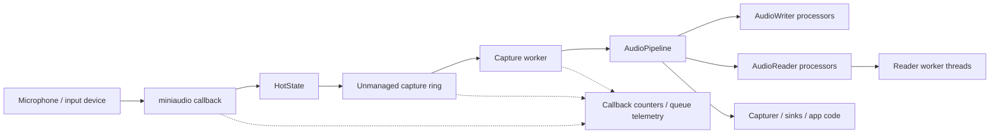

# Recording

EasyMic records external microphone input through miniaudio and delivers interleaved float PCM to managed transport workers.

## Capture Flow



```text
miniaudio callback
  -> HotState
  -> unmanaged capture ring
  -> capture worker
  -> AudioPipeline
  -> processors / Capturer / sinks
```

The native callback does not run user processors. It writes framed PCM into a bounded unmanaged ring and returns quickly. The capture worker drains the ring and executes the recording pipeline.

## Device Selection

Use `EasyMicAPI.Refresh()` and `EasyMicAPI.Devices` to inspect available devices. `EasyMicAPI.Default` returns the default device or the first available device.

```csharp
EasyMicAPI.Refresh();
foreach (var device in EasyMicAPI.Devices)
{
    Debug.Log($"{device.Name} default={device.IsDefault}");
}
```

When a requested device or format is unavailable, EasyMic resolves to a supported channel/rate where possible. `EasyMicrophone` also includes device option helpers for scene workflows.

## Start and Stop Recording

```csharp
var capture = new AudioWorkerBlueprint(() => new Capturer(), "capture");

RecordingHandle handle = EasyMicAPI.StartRecording(
    EasyMicAPI.Default,
    SampleRate.Hz48000,
    Channel.Mono,
    new[] { capture },
    EasyMicLatencyProfile.LowLatency);

// Read processor state while the session is still alive.
var capturer = EasyMicAPI.GetProcessor<Capturer>(handle, capture);
AudioClip clip = capturer?.GetCapturedAudioClip();

EasyMicAPI.StopRecording(handle);
```

`StopRecording` disposes the session. Do not expect `GetProcessor<T>` to return session processors after stopping.

## Using EasyMicrophone

`EasyMicrophone` is the authoring-friendly component for recording scenes. It supports:

- `Init()`;
- `StartRecording()` / `StopRecording()`;
- device options through `DeviceOptions`;
- `OnRecordingStateChanged`;
- `LatestRecordingClip`;
- temporary WAV file capture and save helpers.

Use it when you need inspector-driven setup or sample-style recording UI.

## Capture Ring and Overflow Behavior

The capture ring is bounded by the selected latency profile:

- `UltraLowLatency`: about `0.08s` of capture transport capacity.
- `LowLatency`: about `0.12s`.
- `Balanced`: about `0.25s`.
- `Stable` / `SafeStreaming`: about `0.50s`.

If the ring is full, the callback drops that capture block, increments transport overrun counters, and records dropped frames. This protects the audio callback from blocking.

## Monitoring Capture Health

```csharp
RecordingInfo info = EasyMicAPI.GetRecordingInfo(handle);
EasyMicTelemetrySnapshot t = info.Telemetry;

Debug.Log(
    $"callbacks={t.CallbackCount}, frames={t.FramesReceived}, " +
    $"dropped={t.FramesDropped}, overruns={t.TransportOverruns}, " +
    $"queue={t.LastQueueDepthSamples}");
```

Important capture metrics:

- `FramesReceived`: frames accepted into the capture transport.
- `FramesDropped`: frames dropped because the transport could not accept them.
- `TransportOverruns`: capture ring full events.
- `ProcessorExceptions`: exceptions caught while running pipeline workers.
- `WorkerLateCount`: worker failed to keep the ring above its expected timing.

## Processor Rules

Capture processors run outside the miniaudio callback, but they are still latency-sensitive. Avoid:

- Unity API calls;
- blocking I/O;
- long locks;
- per-frame allocation;
- network calls;
- expensive model inference directly in the transport path.

Use `AudioReader` or an explicit queue to move heavier work to another worker, then dispatch Unity-facing results to the main thread.
