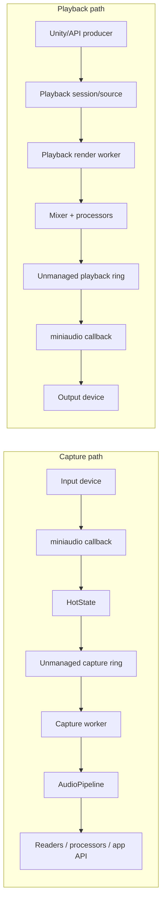

# EasyMic

EasyMic provides external audio capture and playback for Unity using a miniaudio-backed transport layer. It is designed for applications that need low-latency microphone input, custom PCM playback, processor pipelines, and runtime diagnostics without relying only on Unity's built-in audio capture path.

## What It Provides

- Microphone device enumeration and recording through `EasyMicAPI` or `EasyMicrophone`.
- Miniaudio-backed native capture and playback devices.
- Managed C# reverse P/Invoke callbacks with a deliberately small callback path.
- Capture and playback transport workers backed by unmanaged ring buffers.
- Playback streaming and clip playback through `AudioPlayback`, `PlaybackHandle`, and `PlaybackAudioSourceBehaviour`.
- Processor pipelines for capture, playback sources, and mixers.
- Telemetry for callback health, transport overruns/underruns, queue depth, dropped frames, and worker timing.
- Latency profiles from `UltraLowLatency` to `Stable` / `SafeStreaming`.

## Minimum Setup

Requirements:

- Unity `2021.3` or newer.
- The package `com.eitan.easymic`.
- Microphone permission on platforms that require it.
- Unsafe code enabled if your Unity project requires it for the package assembly.

Install through Unity Package Manager, OpenUPM, or by placing the package under `Packages/com.eitan.easymic`.

## First Steps

1. Import the `Recording Example` sample and confirm microphone permission and device enumeration.
2. Import the `AudioPlayback API Example` sample and confirm output playback.
3. Read [Getting Started](en/getting-started.md) for minimal API examples.
4. Use [Diagnostics](en/diagnostics.md) when tuning latency or investigating glitches.

## Architecture Summary

EasyMic keeps the miniaudio callback path intentionally small. The callback moves audio data through preallocated transport buffers and records counters; higher-level processing runs on worker threads or the Unity main thread.



Capture:

```text
miniaudio callback
  -> static C# reverse P/Invoke callback
  -> HotState
  -> unmanaged capture ring
  -> capture worker
  -> AudioPipeline / readers / user-facing API
```

Playback:

```text
Unity/API source
  -> playback render worker
  -> mixer / transport-safe processors
  -> unmanaged playback ring
  -> static C# reverse P/Invoke callback
  -> miniaudio output
```

EasyMic is low-latency managed Unity audio infrastructure. It is not strict hard realtime native middleware; real-time behavior still depends on processor cost, platform scheduling, GC pressure, and device drivers.
