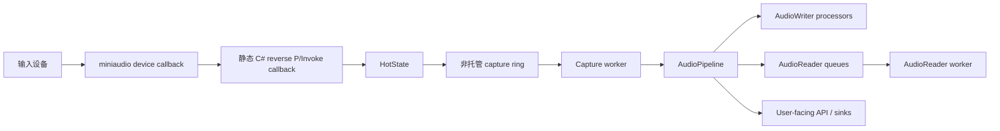
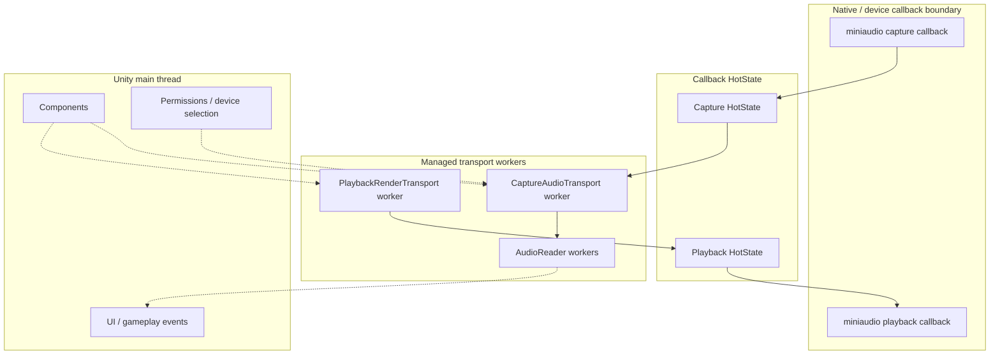

# 架构

EasyMic 使用 miniaudio 访问原生设备，并使用托管 C# 进行 Unity 侧编排。当前架构会保持原生回调很薄，并把处理移动到 transport workers。

## 实际数据流

采集：



```text
miniaudio device callback
  -> static C# reverse P/Invoke callback
  -> callback HotState
  -> unmanaged capture ring
  -> capture worker
  -> AudioPipeline
  -> AudioReader / AudioWriter / user-facing API
```

播放：

```mermaid
flowchart LR
    Producer["Unity/API source or producer"] --> Session["PlaybackAudioSession / PlaybackAudioSource"]
    Session --> RenderWorker["Playback render worker"]
    RenderWorker --> Mixer["AudioMixer"]
    Mixer --> SourceProcessors["Source / mixer processors"]
    SourceProcessors --> PlaybackRing["非托管 playback ring"]
    PlaybackRing --> StaticCb["静态 C# reverse P/Invoke callback"]
    StaticCb --> NativeCb["miniaudio output callback"]
    NativeCb --> Output["输出设备"]
```



```text
Unity playback source / producer
  -> PlaybackAudioSession / PlaybackAudioSource
  -> playback render worker
  -> AudioMixer / transport-safe processors
  -> unmanaged playback ring
  -> static C# reverse P/Invoke callback
  -> miniaudio output
```

EasyMic 会刻意保持 miniaudio 回调路径很小。回调只通过预分配传输缓冲移动音频数据并记录计数器；更高层的处理运行在 worker 线程或 Unity 主线程。

## 线程边界



## 主要运行时模块

| 模块 | 职责 |
|---|---|
| `EasyMicAPI` | 公开录音 facade，用于设备刷新、录音生命周期、处理器管理和录音诊断。 |
| `MicSystem` | 持有 miniaudio capture context、设备缓存、热插拔 watcher 和活动录音 sessions。 |
| `RecordingSession` | 持有一个采集设备、其 callback `HotState`、capture transport、processor blueprint map 和诊断。 |
| `CaptureAudioTransport` | 有界非托管 SPSC ring 加 worker thread，用于采集 frames。 |
| `AudioPipeline` | 由 transport workers 执行的有序不可变处理器 snapshot。 |
| `AudioSystem` | miniaudio 播放设备单例、master mixer、播放回调和 playback telemetry。 |
| `PlaybackRenderTransport` | Playback render worker，会把 mixer block 预渲染进非托管 playback ring。 |
| `PlaybackAudioSession` | 纯 C# clip/stream 播放控制器。 |
| `PlaybackAudioSourceBehaviour` | 用于 clip 和 stream 播放的 Unity component wrapper。 |

## HotState 和 ColdState

`HotState` 是原生回调可以访问的小状态对象。它只包含 callback-safe 引用和标志：transport 指针、telemetry、声道数、stopping/disposed 标志，以及 active callback 计数器。

Cold state 是 session 或 system 的其余部分：设备对象、worker maps、处理器列表、Unity component state、托管事件和生命周期代码。回调不会遍历 cold state。

这种拆分让 stop/dispose 可以先把 hot state 标记为 stopping，短暂等待活动回调 drain，断开 transport，然后释放原生资源。

## 回调模型

EasyMic 仍然通过静态 reverse P/Invoke callbacks 从 miniaudio 进入托管 C#。IL2CPP build 会在需要的平台上使用 `MonoPInvokeCallback` attribute。

回调路径：

- 不运行用户处理器；
- 不调用 Unity API；
- 稳态下不主动分配；
- 把采集输入复制到 transport ring，或从 transport ring 读取播放输出；
- 记录原子 telemetry 计数器；
- 播放数据不可用时对输出 zero-fill。

这适合低延迟托管 Unity 音频，但不是严格的 hard realtime 原生中间件。

## 处理器在哪里运行

| 位置 | 运行内容 |
|---|---|
| miniaudio callback | 仅内部 transport copy/read 和 telemetry。 |
| capture worker | 采集 `AudioPipeline` 处理器。 |
| playback render worker | Mixer/source 处理器和 render 工作。 |
| `AudioReader` worker | 处理器入队 frame 后的 reader-specific async work。 |
| Unity main thread | Components、UI、gameplay、设备选择、权限流程和主线程 dispatch。 |

`AudioPipeline` 使用 immutable snapshots，因此添加或移除处理器不需要锁住 worker 的 hot loop。被移除的 worker 会在活动 pass 完成后安全 retire。

## Unity API 规则

除非 Unity 明确说明，否则 Unity API 都是主线程 API。不要从以下位置调用 Unity API：

- miniaudio callbacks；
- capture transport workers；
- playback render workers；
- `AudioReader` worker threads。

Unity-facing 集成请使用 Unity components、queued events 或 main-thread dispatcher。

## 生命周期说明

- `EasyMicAPI.Cleanup()` 会释放麦克风系统并清除缓存的初始化失败状态。
- Runtime subsystem registration 会在 domain/runtime reload 时重置静态采集和播放状态。
- `AudioSystem.Stop()` 会停止原生设备，等待活动回调，释放 playback transport，清除事件，并释放 miniaudio handles。
- `StopRecording(handle)` 会移除并释放录音 session。如需读取处理器状态，请在停止前读取。

## 给旧版 EasyMic 用户的说明

当前架构使用 hardened callback path。用户处理器不再运行在 miniaudio callback 中。Transport-sensitive 工作运行在 capture/playback workers 上，Unity-facing 事件在 callback 外 dispatch。
