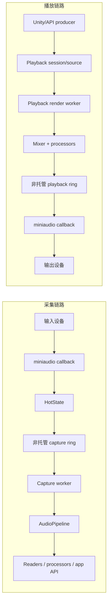

# EasyMic

EasyMic 为 Unity 提供基于 miniaudio 的外部音频采集和播放传输层。它面向需要低延迟麦克风输入、自定义 PCM 播放、处理器流水线和运行时诊断的应用，而不是只依赖 Unity 内置音频采集路径。

## 提供的能力

- 通过 `EasyMicAPI` 或 `EasyMicrophone` 枚举麦克风设备并录音。
- 基于 miniaudio 的原生采集和播放设备访问。
- 托管 C# reverse P/Invoke 回调，且回调路径刻意保持很小。
- 基于非托管 ring buffer 的采集和播放传输 worker。
- 通过 `AudioPlayback`、`PlaybackHandle` 和 `PlaybackAudioSourceBehaviour` 进行流式播放和 clip 播放。
- 用于采集、播放源和 mixer 的处理器流水线。
- 用于回调健康度、传输 overrun/underrun、队列深度、丢帧和 worker 耗时的 telemetry。
- 从 `UltraLowLatency` 到 `Stable` / `SafeStreaming` 的延迟配置。

## 最小设置

要求：

- Unity `2021.3` 或更新版本。
- 包名：`com.eitan.easymic`。
- 在需要的平台上授予麦克风权限。
- 如果项目或包程序集需要，启用 unsafe code。

可以通过 Unity Package Manager、OpenUPM，或将包放在 `Packages/com.eitan.easymic` 下安装。

## 第一步

1. 导入 `Recording Example` 示例，确认麦克风权限和设备枚举正常。
2. 导入 `AudioPlayback API Example` 示例，确认输出播放正常。
3. 阅读 [快速入门](getting-started.md) 获取最小 API 示例。
4. 调延迟或排查 glitch 时阅读 [诊断](diagnostics.md)。
5. 集成 SherpaONNXUnity 时先阅读 [EasyMic × SherpaONNXUnity 使用指南](sherpa-onnx-unity-usage.md)，需要架构背景时阅读 [EasyMic 与 SherpaONNXUnity 原生集成规划](sherpa-onnx-unity-integration-plan.md)，编辑器体验改进参考 [EasyMic × SherpaONNXUnity 编辑器体验改进规划](sherpa-onnx-unity-editor-ux-plan.md)。

## 架构摘要

EasyMic 会刻意保持 miniaudio 回调路径很小。回调只通过预分配传输缓冲移动音频数据并记录计数器；更高层的处理运行在 worker 线程或 Unity 主线程。



采集：

```text
miniaudio callback
  -> static C# reverse P/Invoke callback
  -> HotState
  -> unmanaged capture ring
  -> capture worker
  -> AudioPipeline / readers / user-facing API
```

播放：

```text
Unity/API source
  -> playback render worker
  -> mixer / transport-safe processors
  -> unmanaged playback ring
  -> static C# reverse P/Invoke callback
  -> miniaudio output
```

EasyMic 是面向 Unity 的低延迟托管音频基础设施。它不是严格的原生 hard realtime 中间件；实时表现仍然取决于处理器开销、平台调度、GC 压力和设备驱动。
