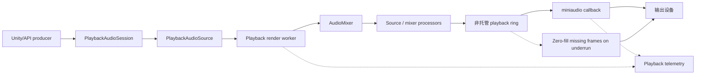

# 播放

EasyMic 播放使用 miniaudio 输出设备、托管 mixer 和 playback render worker。输出 callback 会从非托管 ring 中消费预渲染样本。

## 播放流程



```text
Unity/API source
  -> PlaybackAudioSession / PlaybackAudioSource
  -> playback render worker
  -> AudioMixer / source processors
  -> unmanaged playback ring
  -> miniaudio callback
  -> output device
```

miniaudio callback 不混音 source，也不运行处理器。它从 playback ring 读取，并对缺失 frames zero-fill。

## 播放 AudioClip

```csharp
PlaybackHandle handle = AudioPlayback.PlayClip(
    clip,
    loop: false,
    volume: 1f,
    autoDisposeOnComplete: true,
    latencyProfile: EasyMicLatencyProfile.LowLatency);
```

使用 `PlaybackHandle` 暂停、恢复、停止、修改音量或释放。

## 流式播放 Interleaved PCM

```csharp
PlaybackHandle stream = AudioPlayback.CreateStream(1f, EasyMicLatencyProfile.Balanced);

EasyMicEnqueueResult result = stream.TryEnqueue(
    samples,
    count: samples.Length,
    channels: 1,
    sampleRate: 24000);

if (!result.Success)
{
    Debug.LogWarning($"Could not enqueue all samples: {result.Status}");
}

stream.CompleteStream();
```

`TryEnqueue` 会报告 partial writes、full queues、disposed handles 和 invalid formats。Streaming producers 应关注 `BufferedSeconds`，并避免无限制推送音频。

## 组件播放

`PlaybackAudioSourceBehaviour` 包装 `PlaybackAudioSession`，用于场景播放。

常用成员：

- `PlayClip(AudioClip clip, bool loop = true)`；
- `Play()`、`Resume()`、`Pause()`、`Stop()`；
- `TryEnqueue(...)`；
- `CompleteStream()`；
- `BufferedSeconds`；
- `ProgressNormalized`；
- `OnPlaybackCompleted`；
- `OnAudioPlaybackRead`。

`OnAudioPlaybackRead` 不是 Unity 主线程事件。请把它视为 audio-thread/transport-sensitive 数据，handler 必须保持很小。

## Watermark Scheduling

`PlaybackRenderTransport` 会在 playback ring 中保持目标数量的已渲染音频：

- 低于 low watermark 时，渲染直到达到 target buffer；
- 低于 high watermark 时，机会性渲染一个 block；
- ring 足够满时，短暂等待。

这会让 mixing 和 processor 工作离开 device callback，同时避免不必要的缓冲。

## Underrun 和 Zero Fill

如果输出 callback 请求的 frames 多于 playback ring 中可用 frames，EasyMic 会清空缺失的输出 samples。这样可以保持设备运行，并递增：

- `TransportUnderruns`；
- `ZeroFilledFrames`；
- queue depth telemetry。

频繁 underrun 通常意味着：

- latency profile 太激进；
- playback render worker 被阻塞；
- source/mixer processors 工作过重；
- producers 没有足够早地入队 streamed audio；
- scene loading 或 GC 影响 worker 调度。

## 播放诊断

```csharp
var system = AudioSystem.Instance;
var t = system.Telemetry;

Debug.Log(
    $"running={system.IsRunning}, underruns={t.TransportUnderruns}, " +
    $"zeroFill={t.ZeroFilledFrames}, queue={t.LastQueueDepthSamples}");
```

使用 `AudioSystem.Instance.PipelineSnapshot` 获取 visualizer-style 拓扑，并使用 `AudioSystem.Instance.LatencyStats` 查看以毫秒换算的队列深度。
