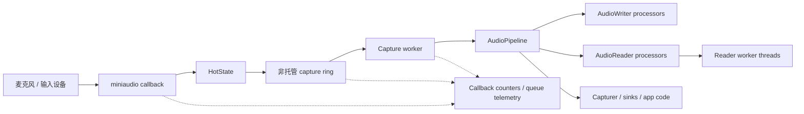

# 录音

EasyMic 通过 miniaudio 录制外部麦克风输入，并把 interleaved float PCM 交给托管 transport workers。

## 采集流程



```text
miniaudio callback
  -> HotState
  -> unmanaged capture ring
  -> capture worker
  -> AudioPipeline
  -> processors / Capturer / sinks
```

原生回调不会运行用户处理器。它会把 framed PCM 写入有界非托管 ring 并快速返回。Capture worker 会 drain 这个 ring 并执行录音 pipeline。

## 设备选择

使用 `EasyMicAPI.Refresh()` 和 `EasyMicAPI.Devices` 查看可用设备。`EasyMicAPI.Default` 返回默认设备，或第一个可用设备。

```csharp
EasyMicAPI.Refresh();
foreach (var device in EasyMicAPI.Devices)
{
    Debug.Log($"{device.Name} default={device.IsDefault}");
}
```

当请求的设备或格式不可用时，EasyMic 会尽可能解析到支持的声道/采样率。`EasyMicrophone` 也包含用于场景工作流的设备选项 helper。

## 启动和停止录音

```csharp
var capture = new AudioWorkerBlueprint(() => new Capturer(), "capture");

RecordingHandle handle = EasyMicAPI.StartRecording(
    EasyMicAPI.Default,
    SampleRate.Hz48000,
    Channel.Mono,
    new[] { capture },
    EasyMicLatencyProfile.LowLatency);

// 在 session 仍然存活时读取处理器状态。
var capturer = EasyMicAPI.GetProcessor<Capturer>(handle, capture);
AudioClip clip = capturer?.GetCapturedAudioClip();

EasyMicAPI.StopRecording(handle);
```

`StopRecording` 会释放 session。停止后不要期望 `GetProcessor<T>` 还能返回该 session 的处理器。

## 使用 EasyMicrophone

`EasyMicrophone` 是面向录音场景的 authoring-friendly 组件。它支持：

- `Init()`；
- `StartRecording()` / `StopRecording()`；
- 通过 `DeviceOptions` 设置设备选项；
- `OnRecordingStateChanged`；
- `LatestRecordingClip`；
- 临时 WAV 文件采集和保存 helpers。

当你需要 inspector-driven 设置或示例式录音 UI 时使用它。

## Capture Ring 和 Overflow 行为

Capture ring 由所选 latency profile 决定容量：

- `UltraLowLatency`：约 `0.08s` capture transport 容量。
- `LowLatency`：约 `0.12s`。
- `Balanced`：约 `0.25s`。
- `Stable` / `SafeStreaming`：约 `0.50s`。

如果 ring 已满，callback 会丢弃该采集 block，递增 transport overrun 计数器，并记录 dropped frames。这样可以避免 audio callback 阻塞。

## 监控采集健康度

```csharp
RecordingInfo info = EasyMicAPI.GetRecordingInfo(handle);
EasyMicTelemetrySnapshot t = info.Telemetry;

Debug.Log(
    $"callbacks={t.CallbackCount}, frames={t.FramesReceived}, " +
    $"dropped={t.FramesDropped}, overruns={t.TransportOverruns}, " +
    $"queue={t.LastQueueDepthSamples}");
```

重要采集指标：

- `FramesReceived`：被 capture transport 接收的 frames。
- `FramesDropped`：transport 无法接收时丢弃的 frames。
- `TransportOverruns`：capture ring 满事件。
- `ProcessorExceptions`：运行 pipeline workers 时捕获的异常。
- `WorkerLateCount`：worker 未能按预期节奏维持 ring。

## 处理器规则

采集处理器运行在 miniaudio callback 外，但仍然对延迟敏感。避免：

- Unity API 调用；
- blocking I/O；
- 长时间持锁；
- 每帧分配；
- 网络调用；
- 直接在 transport path 中执行昂贵模型推理。

使用 `AudioReader` 或显式队列把重工作移动到另一个 worker，然后把 Unity-facing 结果 dispatch 到主线程。
