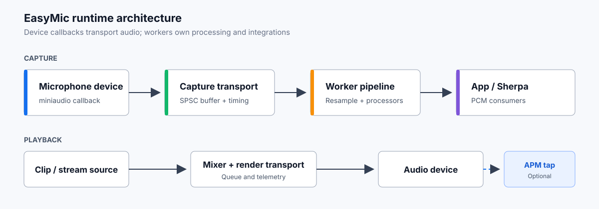

<div align="center">
  

# EasyMic for Unity

**面向 Unity 的低延迟麦克风采集、播放和可扩展音频管线**


[English](README.md) | **中文**
</div>



EasyMic 将原生音频回调限制为轻量传输，并把实际处理放到明确的 worker 管线中。它提供设备采集、片段或流式播放、原始 PCM、运行时遥测以及可选的 SherpaONNXUnity 集成。

## Package 范围

| 能力 | 内容 |
| --- | --- |
| 麦克风采集 | 基于 miniaudio 的设备选择和低延迟 PCM 传输 |
| 播放 | 通过 EasyMic mixer 播放片段或流式音频 |
| 音频处理 | 可组合 worker、重采样、声道转换和门控 |
| 诊断 | 队列深度、延迟、underrun、overflow 和丢帧遥测 |
| SherpaONNXUnity | 可选的单采集 session 语音组件桥接 |
| AEC / ANS / AGC | 独立付费的 [EasyMic APM](https://github.com/EitanWong/com.eitan.easymic.apm) 扩展包 |

## 安装

在 Unity 中打开 `Window > Package Manager`，选择 `Add package from git URL...`，输入：

```text
https://github.com/EitanWong/com.eitan.easymic.git#upm
```

需要 Sherpa 工作流时，再安装：

```text
https://github.com/EitanWong/com.eitan.sherpa-onnx-unity.git#upm
```

## 快速开始

通过 `Component > Audio > EasyMic > Input > Easy Microphone` 添加组件，然后在脚本中引用：

```csharp
using Eitan.EasyMic.Runtime;
using Eitan.EasyMic.Runtime.Mono;
using UnityEngine;

public sealed class Recorder : MonoBehaviour
{
    [SerializeField] private EasyMicrophone microphone;

    private void Start()
    {
        if (!PermissionUtils.HasPermission())
            return;

        microphone.Init();
        microphone.StartRecording();
    }

    private void OnDisable()
    {
        microphone.StopRecording();
    }
}
```

需要 AEC 可见的播放链路或一致的延迟遥测时，使用 `PlaybackAudioSourceBehaviour`，不要使用 Unity `AudioSource`。

## 处理模型

- 设备回调只通过有界缓冲传输交错 float PCM。
- `AudioPipeline` worker 在实时回调之外执行音频处理。
- `AudioContext` 携带采样率、声道数、帧长和采集延迟估计。
- 播放链路提供 EasyMic APM 所需的完整混音 render reference。
- 热路径遥测使用无锁或有界结构，托管分配留在回调之外。

## SherpaONNXUnity

Sherpa 组件需要共享同一个 EasyMic 录音 session 时，使用 `EasyMicSherpaAudioInputSource`。它向 ASR、KWS、VAD、音频标签等组件提供单声道 PCM，避免重复打开麦克风。

编辑器入口：

- `GameObject > SherpaONNX > Audio > EasyMic Audio Input Source`
- `Project Settings > Easy Mic > Integrations > SherpaONNXUnity`
- `Window > Easy Mic > SherpaONNXUnity Diagnostics`

## 示例

在 Package Manager 的 `Samples` 页签中导入。

| 示例 | 重点 |
| --- | --- |
| `Recording Example` | 设备采集和 WAV 输出 |
| `Playback Example` | EasyMic 片段播放 |
| `AudioPlayback API Example` | 代码式流音频播放 |
| `SherpaONNXUnity ASR / KWS / AudioTagging` | Sherpa 共享麦克风输入 |
| `AIChat Example` | ASR、LLM、TTS 和播放编排 |

## 兼容性

- Unity 2021.3 LTS 或更高版本
- Windows、macOS、Linux、Android、iOS
- 支持 .NET Standard 2.1 的 Unity 运行时
- 已配置目标平台麦克风权限

## EasyMic APM

[EasyMic APM](https://github.com/EitanWong/com.eitan.easymic.apm) 扩展是独立授权和付费交付的插件扩展包，提供 AEC、ANS 和 AGC。EasyMic 基础包默认不包含它的源码、原生二进制、示例或授权。

<a href="https://www.bilibili.com/video/BV18hE46rEzw/?share_source=copy_web&vd_source=06d081c8a7b3c877a41f801ce5915855">
  
</a>

[观看哔哩哔哩演示](https://www.bilibili.com/video/BV18hE46rEzw/?share_source=copy_web&vd_source=06d081c8a7b3c877a41f801ce5915855) · 购买与私有交付：[unease-equity-5c@icloud.com](mailto:unease-equity-5c@icloud.com)

## 文档

- [文档索引](Documentation~/README.md)
- [快速入门](Documentation~/zh-CN/getting-started.md)
- [录音](Documentation~/zh-CN/recording.md)
- [播放](Documentation~/zh-CN/playback.md)
- [架构](Documentation~/zh-CN/architecture.md)
- [处理器契约](Documentation~/zh-CN/processors.md)
- [诊断](Documentation~/zh-CN/diagnostics.md)
- [平台说明](Documentation~/zh-CN/platform-notes.md)

## 许可证

EasyMic 使用 [GPL-3.0-only](LICENSE.md) 许可证。第三方声明见 [THIRD PARTY NOTICES](THIRD%20PARTY%20NOTICES.md)。
