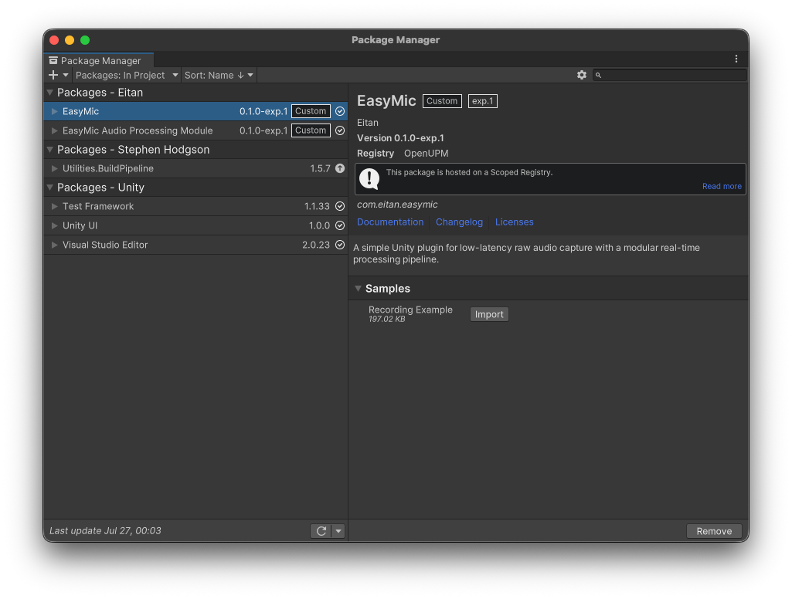

  
  
  # 🎙️ Easy Mic for Unity
  
  **Professional Real-time Audio Recording & Processing Plugin**
  
  
  
  
  
  

    <a href="README_zh-CN.md">🇨🇳 中文版</a> | 
    <strong>🇺🇸 English</strong>
  

  

    <strong>Latest Version:</strong> <code>0.1.2-exp.1</code> (2025-09-22) ·
    <a href="EasyMic/Packages/com.eitan.easymic/CHANGELOG.md">View Changelog</a>
  

  

    <em>Highlights:</em> Added `SherpaKeywordDetector` for wake-word detection. Removed `soundio` dependency on desktop. Optimized performance and audio playback now uses a background thread.
  

  
  

    <em>Perfect for AI Digital Humans • Voice Interactive Applications • Real-time Audio Processing</em>
  

---

  <h2>🎯 What is Easy Mic?</h2>
  
  
<strong>Easy Mic</strong> is a professional <strong>real-time audio recording and processing plugin</strong> designed specifically for Unity developers working on <strong>voice-interactive applications</strong>, <strong>AI digital humans</strong>, and <strong>real-time audio processing projects</strong>.

<table align="center">
  <tr>
    <td align="center" width="20%">
       
      🤖 
      <strong>AI Digital Humans</strong> 
      <em>Voice interaction systems</em>
        
    </td>
    <td align="center" width="20%">
       
      🗣️ 
      <strong>Real-time Voice Chat</strong> 
      <em>Live conversation systems</em>
        
    </td>
    <td align="center" width="20%">
       
      🎙️ 
      <strong>Voice Commands</strong> 
      <em>Recognition systems</em>
        
    </td>
    <td align="center" width="20%">
       
      📞 
      <strong>VoIP & Comms</strong> 
      <em>Communication apps</em>
        
    </td>
    <td align="center" width="20%">
       
      🎮 
      <strong>Voice Gaming</strong> 
      <em>Voice-controlled games</em>
        
    </td>
  </tr>
</table>

  
<em>Easy Mic provides the <strong>low-latency, high-quality audio foundation</strong> your application needs.</em>

---

## 🎬 See It In Action

  
  
  
<strong>Unity Digital Human Microphone Recording Plugin</strong> 
  <em>Solving Echo Cancellation for Conversational AI</em>

  
  
This video demonstrates how Easy Mic solves critical audio challenges in AI conversation systems, particularly the <strong>conversation interruption problem</strong> caused by echo and audio feedback.

---

## ✨ Key Features

  <table>
    <tr>
      <td align="center" width="50%">
        <h3>🎤 Ultra-Low Latency Recording</h3>
        <ul align="left">
          <li>✅ Native backend for minimal audio delay</li>
          <li>✅ Real-time processing for live systems</li>
          <li>✅ Cross-platform support</li>
        </ul>
      </td>
      <td align="center" width="50%">
        <h3>⛓️ Programmable Audio Pipeline</h3>
        <ul align="left">
          <li>✅ Modular design with chainable processors</li>
          <li>✅ Dynamic runtime configuration</li>
          <li>✅ Built-in & custom processors</li>
        </ul>
      </td>
    </tr>
    <tr>
      <td align="center" width="50%">
        <h3>🛡️ Type-Safe & Performance-First</h3>
        <ul align="left">
          <li>✅ Zero-GC audio processing</li>
          <li>✅ Compile-time safety</li>
          <li>✅ Thread-safe operations</li>
        </ul>
      </td>
      <td align="center" width="50%">
        <h3>🔧 Developer-Friendly</h3>
        <ul align="left">
          <li>✅ Simple API design</li>
          <li>✅ Comprehensive documentation</li>
          <li>✅ Active community support</li>
        </ul>
      </td>
    </tr>
  </table>

---

## 💎 EasyMic APM Extension - Professional 3A Audio Processing

  
  
  
For developers working on <strong>Unity AI digital human projects</strong>, we offer the <strong>EasyMic APM (Audio Processing Module)</strong> extension.

  <table>
    <tr>
      <td align="center" width="33%">
        🔇 
        <strong>AEC</strong> 
        <em>Acoustic Echo Cancellation</em> 
        Eliminates echo and feedback
      </td>
      <td align="center" width="33%">
        📢 
        <strong>AGC</strong> 
        <em>Automatic Gain Control</em> 
        Maintains consistent audio levels
      </td>
      <td align="center" width="33%">
        🎯 
        <strong>ANS</strong> 
        <em>Acoustic Noise Suppression</em> 
        Reduces background noise
      </td>
    </tr>
  </table>

  
<strong>📧 Contact:</strong> <a href="mailto:unease-equity-5c@icloud.com">unease-equity-5c@icloud.com</a> | <strong>💬 Bilibili:</strong> Send private message

  
  

---

## 🚀 Quick Start

  <h3>📦 Installation</h3>
    <ol align="left">
      <li>Open Unity Package Manager</li>
      <li>Click <code>+</code> → <code>Add package from git URL...</code></li>
      <li>Enter: <code>https://github.com/EitanWong/com.eitan.easymic.git#upm</code></li>
      <li>Click <code>Add</code></li>
    </ol>
  <h3>📋 Import Sample Scene</h3>
    <ol align="left">
      <li>After importing Easy Mic, go to <strong>Package Manager</strong></li>
      <li>Find <strong>EasyMic</strong> in "In Project" packages</li>
      <li>Expand <strong>Samples</strong> section</li>
      <li>Click <strong>Import</strong> next to "Recording Example"</li>
      <li>Open the imported scene to see microphone recording demo</li>
    </ol>
    
  

    
    
<em>Import the Recording Example sample scene via Package Manager</em>

  

  
  <h3>⚡ Basic Usage</h3>
    

      <pre><code>// Ensure permission (Android triggers system request)
if (!PermissionUtils.HasPermission()) return;

// Refresh device list
EasyMicAPI.Refresh();

// Define processor blueprints
var bpCapture = new AudioWorkerBlueprint(() => new AudioCapturer(10), key: "capture");
var bpDownmix = new AudioWorkerBlueprint(() => new AudioDownmixer(), key: "downmix");

// Start recording (auto-selects default device/channel)
var handle = EasyMicAPI.StartRecording(SampleRate.Hz16000);

// Attach processors
EasyMicAPI.AddProcessor(handle, bpDownmix);
EasyMicAPI.AddProcessor(handle, bpCapture);

// ... later: stop and get captured clip
EasyMicAPI.StopRecording(handle);
var clip = EasyMicAPI.GetProcessor<AudioCapturer>(handle, bpCapture)?.GetCapturedAudioClip();</code></pre>
    

---

## 📚 Documentation

  <h3>📖 Complete Documentation Available</h3>
  
  <table>
    <tr>
      <td align="center" width="25%">
        <a href="EasyMic/Packages/com.eitan.easymic/Documentation~/en/getting-started.md">
          📘 <strong>Getting Started</strong> 
          <em>Installation & first steps</em>
        </a>
      </td>
      <td align="center" width="25%">
        <a href="EasyMic/Packages/com.eitan.easymic/Documentation~/en/core-concepts.md">
          🏗️ <strong>Core Concepts</strong> 
          <em>Architecture overview</em>
        </a>
      </td>
      <td align="center" width="25%">
        <a href="EasyMic/Packages/com.eitan.easymic/Documentation~/en/audio-pipeline.md">
          ⛓️ <strong>Audio Pipeline</strong> 
          <em>Processing system</em>
        </a>
      </td>
      <td align="center" width="25%">
        <a href="EasyMic/Packages/com.eitan.easymic/Documentation~/en/processors.md">
          🧩 <strong>Processors</strong> 
          <em>Available components</em>
        </a>
      </td>
    </tr>
    <tr>
      <td align="center" width="25%">
        <a href="EasyMic/Packages/com.eitan.easymic/Documentation~/en/api-reference.md">
          ⚡ <strong>API Reference</strong> 
          <em>Complete documentation</em>
        </a>
      </td>
      <td align="center" width="25%">
        <a href="EasyMic/Packages/com.eitan.easymic/Documentation~/en/best-practices.md">
          💡 <strong>Best Practices</strong> 
          <em>Optimization tips</em>
        </a>
      </td>
      <td align="center" width="25%">
        <a href="EasyMic/Packages/com.eitan.easymic/Documentation~/en/troubleshooting.md">
          🔧 <strong>Troubleshooting</strong> 
          <em>Common solutions</em>
        </a>
      </td>
      <td align="center" width="25%">
        <a href="EasyMic/Packages/com.eitan.easymic/Documentation~/en/examples.md">
          🚀 <strong>Examples</strong> 
          <em>Example code</em>
        </a>
      </td>
    </tr>
  </table>
  
  

    
  

---

## 🎯 Use Cases

  <table>
    <tr>
      <td align="center" width="25%">
        🤖 
        <strong>AI Digital Humans</strong>
        <ul align="left">
          <li>Real-time voice interaction</li>
          <li>Conversation AI with echo cancellation</li>
          <li>Natural language processing</li>
        </ul>
      </td>
      <td align="center" width="25%">
        🎮 
        <strong>Gaming Applications</strong>
        <ul align="left">
          <li>Voice chat in multiplayer</li>
          <li>Voice commands for control</li>
          <li>Real-time audio effects</li>
        </ul>
      </td>
      <td align="center" width="25%">
        📞 
        <strong>Communication Apps</strong>
        <ul align="left">
          <li>VoIP applications</li>
          <li>Video conferencing tools</li>
          <li>Real-time audio streaming</li>
        </ul>
      </td>
      <td align="center" width="25%">
        🎙️ 
        <strong>Content Creation</strong>
        <ul align="left">
          <li>Podcast recording tools</li>
          <li>Voice-over applications</li>
          <li>Audio content workflows</li>
        </ul>
      </td>
    </tr>
  </table>

---

## 📋 System Requirements

  <table>
    <tr>
      <td align="center" width="25%">
        <strong>Unity</strong> 
        2021.3 LTS or higher
      </td>
      <td align="center" width="25%">
        <strong>Platforms</strong> 
        Windows, macOS, Linux 
        Android, iOS
      </td>
      <td align="center" width="25%">
        <strong>Dependencies</strong> 
        .NET Standard 2.1+
      </td>
      <td align="center" width="25%">
        <strong>Permissions</strong> 
        Microphone access required
      </td>
    </tr>
  </table>

---

## 📄 License

  
This project is licensed under the <strong>GPLv3 License</strong> - see the <a href="LICENSE.md">LICENSE.md</a> file for details.

  
  <table>
    <tr>
      <td align="center" width="50%">
        <h4>✅ Open Source Friendly</h4>
        <ul align="left">
          <li>Free to use in open source projects</li>
          <li>Commercial use allowed with GPL compliance</li>
        </ul>
      </td>
      <td align="center" width="50%">
        <h4>⚠️ Commercial Projects</h4>
        <ul align="left">
          <li>Source code disclosure required</li>
          <li>GPL compliance mandatory for distribution</li>
        </ul>
      </td>
    </tr>
  </table>
  

---

## 🤝 Community & Support

  <table>
    <tr>
      <td align="center" width="33%">
        🐛 
        <strong>Issues & Bug Reports</strong> 
        <a href="https://github.com/EitanWong/com.eitan.easymic/issues">GitHub Issues</a> 
        <em>Check <a href="EasyMic/Packages/com.eitan.easymic/Documentation~/en/troubleshooting.md">Troubleshooting</a> first</em>
      </td>
      <td align="center" width="33%">
        💬 
        <strong>Community Discussion</strong> 
        <a href="https://github.com/EitanWong/com.eitan.easymic/discussions">GitHub Discussions</a> 
        <em>Share projects & get help</em>
      </td>
      <td align="center" width="33%">
        📧 
        <strong>Professional Support</strong> 
        <a href="mailto:unease-equity-5c@icloud.com">Email</a> | Bilibili PM 
        <em>Provide technical support</em>
      </td>
    </tr>
  </table>

---

## 🌟 Why Choose Easy Mic?

  <table>
    <tr>
      <td align="center" width="20%">
        ✅ 
        <strong>Developer-Focused</strong> 
        <em>Extensive documentation, examples, and community support</em>
      </td>
      <td align="center" width="20%">
        ✅ 
        <strong>Performance-Optimized</strong> 
        <em>Zero-GC audio processing for maximum performance</em>
      </td>
      <td align="center" width="20%">
        ✅ 
        <strong>Flexible Architecture</strong> 
        <em>Modular design allows easy customization and extension</em>
      </td>
      <td align="center" width="20%">
        ✅ 
        <strong>Cross-Platform</strong> 
        <em>Single API works across all major Unity platforms</em>
      </td>
    </tr>
  </table>

---

  <h2>🚀 Ready to Build Amazing Voice-Interactive Applications?</h2>
  
  

    
    
    
  

  
  

  
  

    <strong>Made with ❤️ by <a href="https://github.com/EitanWong">Eitan</a></strong> 
    <em>Star ⭐ this repo if Easy Mic helps your project!</em>
  

  
  

    
    
  

