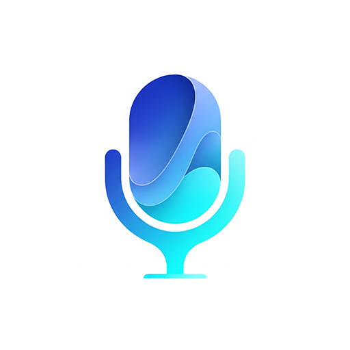

<p align="right">
  <a href="README.md">English</a>
</p>

# Easy Mic for Unity 🎤

<p align="center">
  
</p>

**Easy Mic** 是一款革命性的Unity高性能、低延迟音频录制插件，彻底改变了音频捕获和处理方式。它提供对原始麦克风数据的直接访问，并引入了强大的可编程音频处理流水线，让开发者能够轻松创建复杂的实时音频工作流。

## ✨ 核心功能

*   **🎤 超低延迟录制**: 使用优化的原生后端库以最小延迟捕获麦克风音频，完美适用于实时应用和交互体验。
*   **🔊 原始音频缓冲区访问**: 直接访问来自麦克风的未处理音频数据，为您提供音频操作和处理的完全控制权。
*   **⛓️ 可编程处理流水线**: Easy Mic的核心特性 - 动态构建、修改和优化音频处理器链。可在不中断音频流的情况下实时添加、删除或重新排序处理器。
*   **💻 真正的跨平台支持**: 在Windows、macOS、Linux、Android和iOS上提供统一API，具有平台优化的原生实现。
*   **🧩 丰富的内置处理器库**: 为常见音频任务提供全面的预构建处理器集合，开箱即用。
*   **🔌 可扩展架构**: 专为未来扩展而设计，支持自定义处理器和第三方集成。

## 🚀 音频处理流水线

Easy Mic的革命性方法围绕其灵活、可编程的音频流水线展开。录制激活时，音频数据流经您定义的可自定义处理器链：

```
🎙️ 麦克风输入 → [处理器 A] → [处理器 B] → [处理器 C] → 🔊 最终输出
```

这种模块化架构让您能够：
- **混合搭配** 处理器以创建自定义音频工作流
- **实时修改** 录制期间的处理链
- **性能优化** 通过仅使用必要的处理器
- **轻松调试** 通过隔离特定的处理阶段

## 🛠️ 内置音频处理器

Easy Mic 配备了全面的音频处理器套件：

### 核心处理器
*   **📼 `AudioCapturer`**: 高性能音频捕获到内存缓冲区或直接文件输出，支持多种格式。
*   **🔄 `AudioDownmixer`**: 智能多通道到单声道转换，具有可配置的混音算法。
*   **🔇 `VolumeGateFilter`**: 高级噪声门，具有可自定义的阈值、攻击和释放参数。
*   **🔁 `LoopbackPlayer`**: 用于监控和测试应用的实时音频回环。

### AI 集成
*   **🗣️ `SherpaRealtimeSpeechRecognizer`**: 使用Sherpa-ONNX引擎的尖端实时语音转文本。**需要：** [com.eitan.sherpa-onnx-unity](https://github.com/EitanWong/com.eitan.sherpa-onnx-unity)

### 专业音频增强 💎
对于需要录音棚品质音频的生产就绪应用，请考虑 **EasyMic 音频处理模块 (APM)**：

*   **🚫 AEC (声学回声消除)**: 消除声学回声，实现水晶般清晰的语音通信
*   **🔇 ANS (自动噪声抑制)**: 在保持语音质量的同时去除背景噪声
*   **📊 AGC (自动增益控制)**: 自动维护一致的音频电平

**非常适合AI数字人和虚拟主播**: 解决了基于Unity的对话AI应用中系统输出干扰麦克风输入的关键回声问题。

💰 APM 为付费扩展包，使用前需联系作者购买许可证。  
📧 联系方式：[unease-equity-5c@icloud.com](mailto:unease-equity-5c@icloud.com)  
🛒 第三方商店即将上线，便于购买与授权。

## 📦 安装

### 方法1：Unity包管理器（推荐）
1. 打开Unity包管理器 (`Window > Package Manager`)
2. 点击 `+` 按钮 → `Add package from git URL...`
3. 输入：`https://github.com/EitanWong/com.eitan.easymic.git#upm`
4. 点击 `Add`

### 方法2：手动安装
1. 从 [GitHub发布页面](https://github.com/EitanWong/com.eitan.easymic/releases) 下载最新版本
2. 解压并放置在项目的 `Packages` 文件夹中
3. Unity将自动检测并导入包

## ▶️ 快速入门指南

### 基础录制示例
```csharp
using Eitan.EasyMic.Runtime;
using UnityEngine;

public class SimpleRecorder : MonoBehaviour
{
    private RecordingHandle _handle;
    private AudioWorkerBlueprint _bpCapture;

    void Start()
    {
        if (!PermissionUtils.HasPermission()) return;
        EasyMicAPI.Refresh();
        var devs = EasyMicAPI.Devices;
        if (devs.Length == 0) return;

        _bpCapture = new AudioWorkerBlueprint(() => new AudioCapturer(5), key: "capture");
        _handle = EasyMicAPI.StartRecording(devs[0].Name, SampleRate.Hz48000, devs[0].GetDeviceChannel(), new[]{ _bpCapture });
        Invoke(nameof(StopRecording), 5f);
    }

    void StopRecording()
    {
        if (!_handle.IsValid) return;
        EasyMicAPI.StopRecording(_handle);
        var capturer = EasyMicAPI.GetProcessor<AudioCapturer>(_handle, _bpCapture);
        var clip = capturer?.GetCapturedAudioClip();
        if (clip != null) GetComponent<AudioSource>()?.PlayOneShot(clip);
        _handle = default;
    }
}
```

### 高级流水线示例
```csharp
using Eitan.EasyMic.Runtime;
using UnityEngine;

public class AdvancedAudioPipeline : MonoBehaviour
{
    private RecordingHandle _handle;
    private AudioWorkerBlueprint _bpGate, _bpDownmix, _bpCapture;

    void Start()
    {
        if (!PermissionUtils.HasPermission()) return;
        EasyMicAPI.Refresh();
        var d = EasyMicAPI.Devices;
        if (d.Length == 0) return;

        _bpGate    = new AudioWorkerBlueprint(() => new VolumeGateFilter { ThresholdDb = -35 }, key: "gate");
        _bpDownmix = new AudioWorkerBlueprint(() => new AudioDownmixer(), key: "downmix");
        _bpCapture = new AudioWorkerBlueprint(() => new AudioCapturer(10), key: "capture");

        _handle = EasyMicAPI.StartRecording(d[0].Name, SampleRate.Hz44100, d[0].GetDeviceChannel(),
            new[]{ _bpGate, _bpDownmix, _bpCapture });
    }
}
```

## 🎯 使用场景

### 🤖 AI与虚拟角色
- **数字人对话**: 无回声干扰的清晰语音交互
- **语音控制NPC**: 游戏角色的实时语音识别
- **虚拟主播**: 虚拟网红的专业品质语音捕获

### 🎮 游戏应用
- **语音聊天系统**: 多人游戏的低延迟通信
- **语音命令**: 游戏机制的响应式语音控制
- **音频录制**: 游戏内语音消息和回放系统

### 📱 交互应用
- **语音助手**: 构建自定义语音AI应用
- **语言学习**: 发音练习和反馈系统
- **音频制作**: 实时音频处理和效果

## 🔧 系统要求

- **Unity**: 2021.3 LTS 或更高版本
- **平台**: Windows, macOS, Linux, Android, iOS
- **麦克风**: 任何系统识别的音频输入设备
- **内存**: 最小开销，高效的原生实现

## 📚 文档与支持

- 📖 **[完整文档](Documentation~/README.md)**: 全面的指南和API参考
- 💻 **[示例项目](Samples~/)**: 即用的示例和教程
- 🐛 **[问题跟踪](https://github.com/EitanWong/com.eitan.easymic/issues)**: 错误报告和功能请求
- 💬 **[讨论区](https://github.com/EitanWong/com.eitan.easymic/discussions)**: 社区支持和技巧

## 🤝 贡献

欢迎贡献！请阅读我们的 [贡献指南](CONTRIBUTING.md) 和 [行为准则](CODE_OF_CONDUCT.md)。

## 📄 许可证

本项目采用 **GPLv3 许可证** 授权。详情请参见 [LICENSE.md](LICENSE.md)。

### 重要许可证要点：
- ✅ **免费使用** 用于个人和商业项目
- ✅ **修改和分发** 在相同许可证条款下
- ✅ **包含在开源项目中** 无限制
- ⚠️ **Copyleft要求**: 衍生作品也必须在GPLv3下开源

## 🚨 为什么严格遵守开源协议至关重要？

### 开源协议不是建议，而是法律义务

在当今的软件开发世界中，开源软件已成为创新的基石。然而，**许多开发者和企业对开源协议的理解存在严重误区**，错误地认为"开源"等同于"免费随意使用"。这种认知不仅是错误的，更可能导致严重的法律后果。

### GPLv3协议的核心要求

**GPLv3不是普通的MIT或Apache许可证**。它是一个强Copyleft协议，核心要求包括：

1. **🔒 代码共享义务**: 如果您修改了本项目代码并在任何形式的软件产品中使用（包括但不限于商业软件、SaaS服务、移动应用等），您**必须**将修改后的完整代码以GPLv3协议开源。

2. **📋 协议传递性**: 任何包含或链接GPLv3代码的软件，其整体也必须采用GPLv3协议。这意味着您的整个项目可能都需要开源。

3. **⚖️ 法律约束力**: 这些不是"建议"或"最佳实践"，而是具有法律约束力的要求。违反可能面临版权侵权诉讼。

### 真实案例与警示

近年来，已有多家公司因违反GPL协议而面临法律诉讼，包括：
- **重大法律案件**: 多家知名公司因未遵守GPL要求而被诉讼，最终支付巨额赔偿
- **业务影响**: 被迫开源核心代码，或停止使用相关软件
- **声誉损失**: 在开发者社区中的信誉受损

### 如何正确使用GPLv3软件

#### ✅ 合规使用方式：
1. **开源项目**: 在其他GPLv3或兼容协议的开源项目中使用
2. **内部使用**: 仅在组织内部使用，不对外分发
3. **遵循义务**: 如需分发，完整遵守所有GPLv3要求

#### ❌ 违规使用方式：
1. **商业软件闭源**: 在闭源商业软件中包含GPLv3代码
2. **部分开源**: 只开源修改部分，隐藏其他相关代码  
3. **协议变更**: 试图将GPLv3代码改为其他许可证

### 对于中国开发者的特别提醒

在中国的软件开发环境中，对开源协议的重视程度仍有待提高。但请注意：

1. **📈 法律环境变化**: 中国的知识产权保护日益严格，开源协议违规的法律风险正在增加
2. **🌍 国际业务**: 如果您的软件面向国际市场，必须遵守国际开源协议标准
3. **🏢 企业责任**: 作为开发者，您有责任向您的雇主或客户说明开源协议的要求

### 我的立场与承诺

作为Easy Mic的作者，我选择GPLv3协议有以下考虑：

1. **🛡️ 保护开源生态**: 确保对社区的贡献能够回馈给整个社区
2. **⚡ 推动创新**: 鼓励更多开源创新，而非闭源垄断
3. **💪 维护权益**: 保护原创者和贡献者的合法权益

**我将积极维护自己的权益，对于违反GPLv3协议的行为，我保留采取法律行动的权利。**

### 如果您需要商业许可

如果GPLv3的Copyleft要求与您的商业需求不符，我也理解这种情况。请通过以下方式联系我讨论**商业许可方案**：

📧 **商业许可咨询**: [unease-equity-5c@icloud.com](mailto:unease-equity-5c@icloud.com)

我愿意在合理的条件下提供更灵活的许可选项。

### 结语

开源软件的繁荣需要每一位开发者的共同维护。遵守开源协议不仅是法律要求，更是对整个开发者社区的尊重和责任。

**让我们一起建设一个健康、可持续的开源生态环境！** 🌱

---

**由 [Eitan](https://github.com/EitanWong) 用 ❤️ 制作**

*赋能开发者在Unity中创造出色的音频体验*
