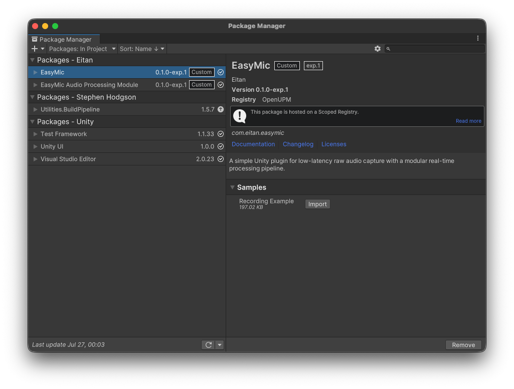

  
  
  # 🎙️ Easy Mic for Unity
  
  **专业实时音频录制和处理插件**
  
  
  
  
  
  

    <strong>🇨🇳 中文版</strong> | 
    <a href="README.md">🇺🇸 English</a>
  

  

    <strong>最新版本：</strong><code>0.1.2-exp.1</code>（2025-09-22） ·
    <a href="EasyMic/Packages/com.eitan.easymic/CHANGELOG.md">查看更新日志</a>
  

  

    <em>更新要点：</em> 添加了 `SherpaKeywordDetector` 唤醒词检测器。移除了桌面平台的 `soundio` 依赖。优化了性能，音频播放现在使用后台线程。
  

  
  

    <em>完美适配 AI 数字人 • 语音交互应用 • 实时音频处理</em>
  

---

  <h2>🎯 什么是 Easy Mic？</h2>
  
  
<strong>Easy Mic</strong> 是专为 Unity 开发者设计的<strong>专业实时音频录制和处理插件</strong>，特别适用于开发<strong>语音交互应用</strong>、<strong>AI 数字人</strong>和<strong>实时音频处理项目</strong>。

<table align="center">
  <tr>
    <td align="center" width="20%">
       
      🤖 
      <strong>AI 数字人</strong> 
      <em>语音交互系统</em>
        
    </td>
    <td align="center" width="20%">
       
      🗣️ 
      <strong>实时语音聊天</strong> 
      <em>实时对话系统</em>
        
    </td>
    <td align="center" width="20%">
       
      🎙️ 
      <strong>语音命令</strong> 
      <em>识别系统</em>
        
    </td>
    <td align="center" width="20%">
       
      📞 
      <strong>VoIP 通信</strong> 
      <em>通信应用</em>
        
    </td>
    <td align="center" width="20%">
       
      🎮 
      <strong>语音游戏</strong> 
      <em>语音控制游戏</em>
        
    </td>
  </tr>
</table>

  
<em>Easy Mic 为您的应用程序提供<strong>低延迟、高质量的音频基础</strong>。</em>

---

## 🎬 实际演示

  
  
  
<strong>Unity数字人麦克风录音插件</strong> 
  <em>解决数字人对话打断回声消除问题</em>

  
  
这个视频演示了 Easy Mic 如何解决 AI 对话系统中的关键音频挑战，特别是由回声和音频反馈引起的<strong>对话打断问题</strong>。

---

## ✨ 核心功能

  <table>
    <tr>
      <td align="center" width="50%">
        <h3>🎤 超低延迟录音</h3>
        <ul align="left">
          <li>✅ 原生后端实现最小音频延迟</li>
          <li>✅ 实时处理适用于实时系统</li>
          <li>✅ 跨平台支持</li>
        </ul>
      </td>
      <td align="center" width="50%">
        <h3>⛓️ 可编程音频管道</h3>
        <ul align="left">
          <li>✅ 模块化设计与可链式处理器</li>
          <li>✅ 动态运行时配置</li>
          <li>✅ 内置和自定义处理器</li>
        </ul>
      </td>
    </tr>
    <tr>
      <td align="center" width="50%">
        <h3>🛡️ 类型安全与性能优先</h3>
        <ul align="left">
          <li>✅ 零GC音频处理</li>
          <li>✅ 编译时安全</li>
          <li>✅ 线程安全操作</li>
        </ul>
      </td>
      <td align="center" width="50%">
        <h3>🔧 开发者友好</h3>
        <ul align="left">
          <li>✅ 简单API设计</li>
          <li>✅ 全面文档</li>
          <li>✅ 活跃社区支持</li>
        </ul>
      </td>
    </tr>
  </table>

---

## 💎 EasyMic APM 扩展包 - 专业 3A 音频处理

  
  
  
对于从事 <strong>Unity AI 数字人项目</strong>的开发者，我们提供 <strong>EasyMic APM（音频处理模块）</strong>扩展包。

  <table>
    <tr>
      <td align="center" width="33%">
        🔇 
        <strong>AEC</strong> 
        <em>声学回声消除</em> 
        消除回声和反馈
      </td>
      <td align="center" width="33%">
        📢 
        <strong>AGC</strong> 
        <em>自动增益控制</em> 
        维持一致的音频电平
      </td>
      <td align="center" width="33%">
        🎯 
        <strong>ANS</strong> 
        <em>声学噪声抑制</em> 
        减少背景噪音
      </td>
    </tr>
  </table>

  
<strong>📧 联系：</strong> <a href="mailto:unease-equity-5c@icloud.com">unease-equity-5c@icloud.com</a> | <strong>💬 B站：</strong> 发送私信

  
  

---

## 🚀 快速开始

  <h3>📦 安装</h3>
    <ol align="left">
      <li>打开 Unity Package Manager</li>
      <li>点击 <code>+</code> → <code>Add package from git URL...</code></li>
      <li>输入: <code>https://github.com/EitanWong/com.eitan.easymic.git#upm</code></li>
      <li>点击 <code>Add</code></li>
    </ol>
  <h3>📋 导入示例场景</h3>
    <ol align="left">
      <li>导入 Easy Mic 后，前往 <strong>Package Manager</strong></li>
      <li>在 "In Project" 包中找到 <strong>EasyMic</strong></li>
      <li>展开 <strong>Samples</strong> 部分</li>
      <li>点击 "Recording Example" 旁边的 <strong>Import</strong></li>
      <li>打开导入的场景查看麦克风录制演示</li>
    </ol>
    
  

    
    
<em>通过 Package Manager 导入 Recording Example 示例场景</em>

  

  
  <h3>⚡ 基本使用</h3>
    

      <pre><code>// 检查权限（Android 会弹系统授权）
if (!PermissionUtils.HasPermission()) return;

// 刷新设备列表
EasyMicAPI.Refresh();

// 定义处理器蓝图
var bpCapture = new AudioWorkerBlueprint(() => new AudioCapturer(10), key: "capture");
var bpDownmix = new AudioWorkerBlueprint(() => new AudioDownmixer(), key: "downmix");

// 开始录音（自动选择默认设备/声道）
var handle = EasyMicAPI.StartRecording(SampleRate.Hz16000);

// 挂载处理器
EasyMicAPI.AddProcessor(handle, bpDownmix);
EasyMicAPI.AddProcessor(handle, bpCapture);

// …稍后：停止并获取录音结果
EasyMicAPI.StopRecording(handle);
var clip = EasyMicAPI.GetProcessor<AudioCapturer>(handle, bpCapture)?.GetCapturedAudioClip();</code></pre>
    

---

## 📚 文档

  <h3>📖 完整文档可用</h3>
  
  <table>
    <tr>
      <td align="center" width="25%">
        <a href="EasyMic/Packages/com.eitan.easymic/Documentation~/zh-CN/getting-started.md">
          📘 <strong>入门指南</strong> 
          <em>安装和第一步</em>
        </a>
      </td>
      <td align="center" width="25%">
        <a href="EasyMic/Packages/com.eitan.easymic/Documentation~/zh-CN/core-concepts.md">
          🏗️ <strong>核心概念</strong> 
          <em>架构概览</em>
        </a>
      </td>
      <td align="center" width="25%">
        <a href="EasyMic/Packages/com.eitan.easymic/Documentation~/zh-CN/audio-pipeline.md">
          ⛓️ <strong>音频管道</strong> 
          <em>处理系统</em>
        </a>
      </td>
      <td align="center" width="25%">
        <a href="EasyMic/Packages/com.eitan.easymic/Documentation~/zh-CN/processors.md">
          🧩 <strong>处理器</strong> 
          <em>可用组件</em>
        </a>
      </td>
    </tr>
    <tr>
      <td align="center" width="25%">
        <a href="EasyMic/Packages/com.eitan.easymic/Documentation~/zh-CN/api-reference.md">
          ⚡ <strong>API 参考</strong> 
          <em>完整文档</em>
        </a>
      </td>
      <td align="center" width="25%">
        <a href="EasyMic/Packages/com.eitan.easymic/Documentation~/zh-CN/best-practices.md">
          💡 <strong>最佳实践</strong> 
          <em>优化技巧</em>
        </a>
      </td>
      <td align="center" width="25%">
        <a href="EasyMic/Packages/com.eitan.easymic/Documentation~/zh-CN/troubleshooting.md">
          🔧 <strong>故障排除</strong> 
          <em>常见解决方案</em>
        </a>
      </td>
      <td align="center" width="25%">
        <a href="EasyMic/Packages/com.eitan.easymic/Documentation~/zh-CN/examples.md">
          🚀 <strong>示例</strong> 
          <em>案例代码</em>
        </a>
      </td>
    </tr>
  </table>
  
  

    
  

---

## 🎯 使用场景

  <table>
    <tr>
      <td align="center" width="25%">
        🤖 
        <strong>AI 数字人</strong>
        <ul align="left">
          <li>实时语音交互</li>
          <li>带回声消除的对话AI</li>
          <li>自然语言处理</li>
        </ul>
      </td>
      <td align="center" width="25%">
        🎮 
        <strong>游戏应用</strong>
        <ul align="left">
          <li>多人游戏语音聊天</li>
          <li>语音控制命令</li>
          <li>实时音频效果</li>
        </ul>
      </td>
      <td align="center" width="25%">
        📞 
        <strong>通信应用</strong>
        <ul align="left">
          <li>VoIP 应用程序</li>
          <li>视频会议工具</li>
          <li>实时音频流</li>
        </ul>
      </td>
      <td align="center" width="25%">
        🎙️ 
        <strong>内容创作</strong>
        <ul align="left">
          <li>播客录制工具</li>
          <li>配音应用程序</li>
          <li>音频内容工作流</li>
        </ul>
      </td>
    </tr>
  </table>

---

## 📋 系统要求

  <table>
    <tr>
      <td align="center" width="25%">
        <strong>Unity</strong> 
        2021.3 LTS 或更高版本
      </td>
      <td align="center" width="25%">
        <strong>平台</strong> 
        Windows, macOS, Linux 
        Android, iOS
      </td>
      <td align="center" width="25%">
        <strong>依赖</strong> 
        .NET Standard 2.1+
      </td>
      <td align="center" width="25%">
        <strong>权限</strong> 
        需要麦克风访问权限
      </td>
    </tr>
  </table>

---

## 📄 许可证

  
本项目采用 <strong>GPLv3 许可证</strong> - 详见 <a href="LICENSE.md">LICENSE.md</a> 文件。

  
  <table>
    <tr>
      <td align="center" width="50%">
        <h4>✅ 开源友好</h4>
        <ul align="left">
          <li>开源项目免费使用</li>
          <li>允许商业使用（需遵守GPL）</li>
        </ul>
      </td>
      <td align="center" width="50%">
        <h4>⚠️ 商业项目</h4>
        <ul align="left">
          <li>需要公开源代码</li>
          <li>分发时必须遵守GPL</li>
        </ul>
      </td>
    </tr>
  </table>
  

---

## 🤝 社区与支持

  <table>
    <tr>
      <td align="center" width="33%">
        🐛 
        <strong>问题与错误报告</strong> 
        <a href="https://github.com/EitanWong/com.eitan.easymic/issues">GitHub Issues</a> 
        <em>请先查看 <a href="EasyMic/Packages/com.eitan.easymic/Documentation~/zh-CN/troubleshooting.md">故障排除</a></em>
      </td>
      <td align="center" width="33%">
        💬 
        <strong>社区讨论</strong> 
        <a href="https://github.com/EitanWong/com.eitan.easymic/discussions">GitHub Discussions</a> 
        <em>分享项目并获得帮助</em>
      </td>
      <td align="center" width="33%">
        📧 
        <strong>专业支持</strong> 
        <a href="mailto:unease-equity-5c@icloud.com">邮件</a> | B站私信 
        <em>提供技术指导</em>
      </td>
    </tr>
  </table>

---

## 🌟 为什么选择 Easy Mic？

  <table>
    <tr>
      <td align="center" width="20%">
        ✅ 
        <strong>生产就绪</strong> 
        <em>经过实战检验的架构，适用于商业应用</em>
      </td>
      <td align="center" width="20%">
        ✅ 
        <strong>开发者导向</strong> 
        <em>丰富的文档、示例和社区支持</em>
      </td>
      <td align="center" width="20%">
        ✅ 
        <strong>性能优化</strong> 
        <em>零GC音频处理以获得最大性能</em>
      </td>
      <td align="center" width="20%">
        ✅ 
        <strong>灵活架构</strong> 
        <em>模块化设计允许轻松定制和扩展</em>
      </td>
      <td align="center" width="20%">
        ✅ 
        <strong>跨平台</strong> 
        <em>单一API适用于所有主要Unity平台</em>
      </td>
    </tr>
  </table>

---

  <h2>🚀 准备构建令人惊叹的语音交互应用？</h2>
  
  

    
    
    
  

  
  

  
  

    <strong>Made with ❤️ by <a href="https://github.com/EitanWong">Eitan</a></strong> 
    <em>如果 Easy Mic 对您的项目有帮助，请给我们一个 ⭐！</em>
  

  
  

    
    
  

